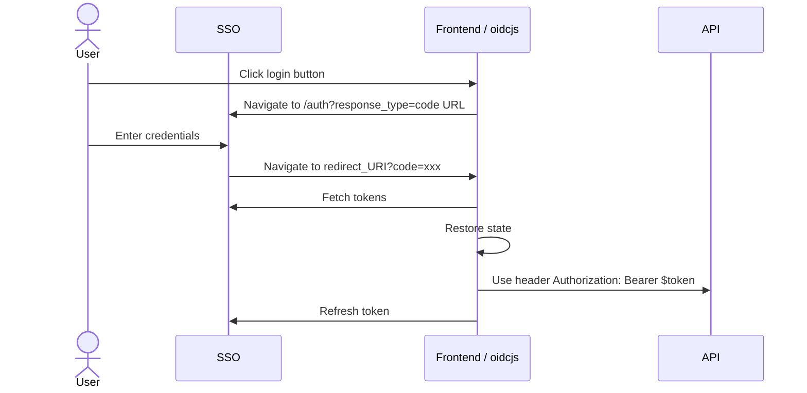

# OpenID Connect practical guide

## Entities



## Frontend part (pure UI)

See https://github.com/geoblocks/oidcjs/blob/master/index.html

```shell
npm start
browse http://localhost:8000

```

## Backend part (pure python example)

The JSON Web Key Set (JWKS) is a set of keys containing the public keys used to verify any JSON Web Token (JWT) issued by the Authorization Server and signed using the RS256 signing algorithm. Your SSO should provide it publicly.

```python
# Done once
jwks_url = "https://keycloak.qa.fastforward.ch/realms/smobil-staging/protocol/openid-connect/certs"
self.jwks_client = PyJWKClient(jwks_url)
```

```python
# For each request
raw_token = request.getHeader('Authorization')
signing_key = self.jwks_client.get_signing_key_from_jwt(raw_token)

payload = jwt.decode(
    raw_token,
    signing_key.key,
    algorithms=[
        "RS256",
    ],
    options={
        "require": ["exp", "iss", "roles", "uid"],
        "verify_iss": True,
        "verify_exp": True,
        # "verify_iat": True,
    },
)
user_id = payload.get("uid")
roles = payload.get("roles")
```
